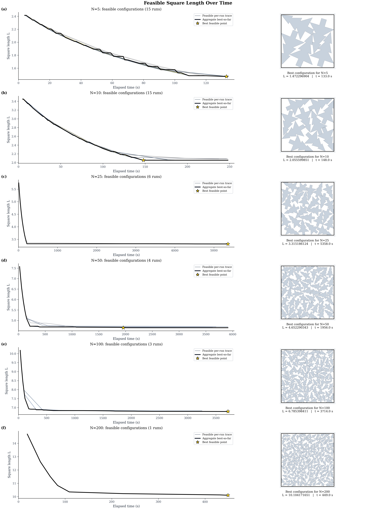
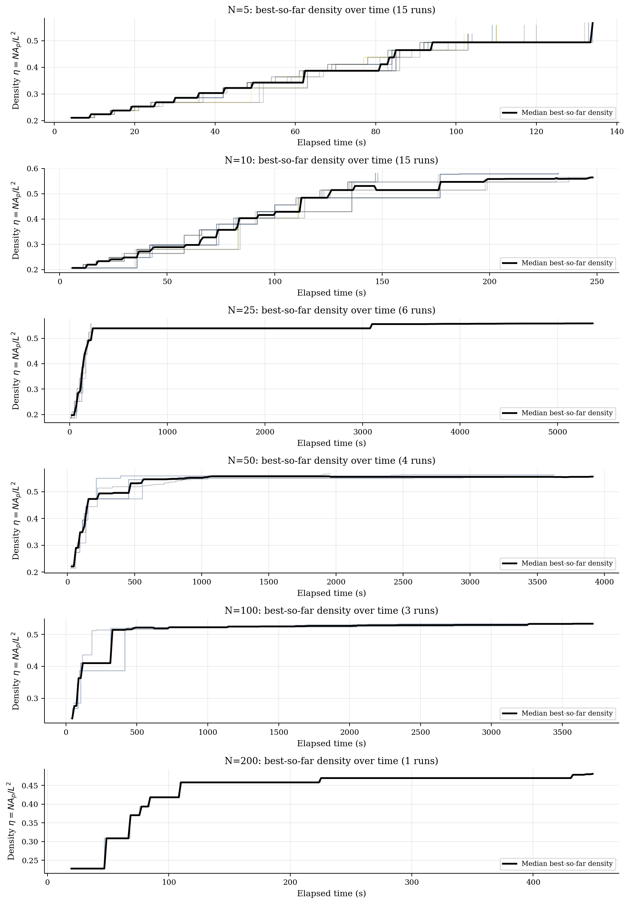
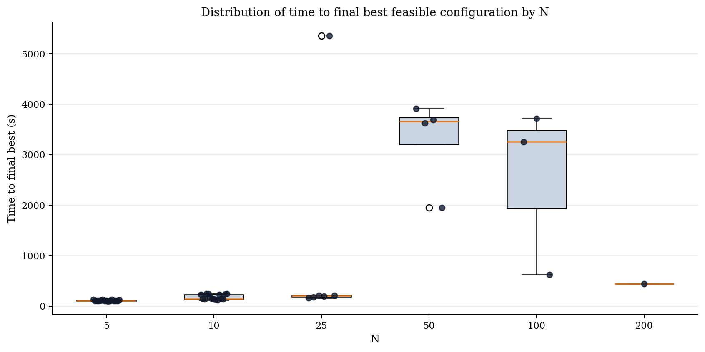

# Non-Convex Polygon Packing

Parallel optimization study for minimizing the side length $L$ of a square containing $N$ identical non-convex polygons. Compares three strategies — **Multi-Start (MS)**, **Elite-Resample Multi-Start (ER-MS)**, and **Parallel Tempering (PT)** — under HPC constraints (≤20 CPU cores, ≤4 hours wall-clock).

## Repository Layout

```
run/HPC_DEMO/           ← Main study solver (the one you want)
  src/                  Source files (main.c, method_ms.c, method_erms.c, method_pt.c, ...)
  include/              Headers (replica.h, methods.h, bisection.h, physics.h, ...)
  tests/                Unit tests (8 test binaries)
  scripts/              Slurm job scripts + build/gate helpers
  analysis/             aggregate.py, validate_schema.py
  out/                  Solver outputs (bisection CSV, log CSV, SVGs)
  csv/                  Legacy single-run results (N=1–200)
  docs/                 CSV_SCHEMA.md

2025/HPC/               Legacy standalone HPC solver (hpc_parallel.c)
2025/parallel/          Experimental GPU/CUDA track (chimera solver)
2025/sa_circlepack/     Minimal circle-packing SA baseline
2025/sa_packing_solvers/ Enhanced SA solvers with bounds/feasibility
2025/sa_pack_shrink/    Circle packing with shrinking heuristic
2025/sa_pack_poly_shrink/ Polygon packing with tree initialization
2025/cmaes/             CMA-ES polygon packing

report/                 LaTeX report (main.tex + chapters/)
docs/                   Engineering spec, roadmap, tracking, inventory
tests/                  Top-level unit tests (AABB, geometry, spatial_hash, IO, utils)
```

## Quick Start

### Build the study solver

```bash
cd run/HPC_DEMO
make            # builds bin/solver
make test       # runs all 8 unit tests
```

### Run locally (demo mode)

```bash
# Pack N=10 polygons, 5 trials
./bin/solver 10 5 my_prefix

# Pack with specific seed
./bin/solver 10 5 my_prefix 42 0
```

### Run in study mode (method comparison)

```bash
# MS method, 4 replicas, N=20, 60-second budget
OMP_NUM_THREADS=4 ./bin/solver --study --method ms --R 4 --N 20 \
    --time_budget_sec 60 --seed 42 --run_id 0 \
    --out_prefix out/test_ms --mode graph --save_best

# ER-MS method
OMP_NUM_THREADS=4 ./bin/solver --study --method erms --R 4 --N 20 \
    --time_budget_sec 60 --seed 42 --run_id 0 \
    --out_prefix out/test_erms --mode graph --save_best

# PT method
OMP_NUM_THREADS=4 ./bin/solver --study --method pt --R 4 --N 20 \
    --time_budget_sec 60 --seed 42 --run_id 0 \
    --out_prefix out/test_pt --mode graph --save_best
```

### Submit on HPC (Slurm)

```bash
cd run/HPC_DEMO

# 1. Run decision gates first
bash scripts/submit_gates.sh
# Wait for completion, then check:
bash scripts/check_gates.sh

# 2. Full graph suite (3 methods × 5 N-values × 2 seeds)
sbatch scripts/run_graph_suite.slurm

# 3. Hero run (N=200, R=20, best method)
sbatch scripts/run_hero.slurm
```

### Analyze results

```bash
cd run/HPC_DEMO
python3 analysis/aggregate.py out/some_prefix_bisection.csv
python3 analysis/validate_schema.py out/some_prefix_bisection.csv
```

## Build legacy solvers (top-level)

```bash
# From repo root — builds all legacy binaries into bin/
make
make test       # unit tests against run/HPC_DEMO/include
make coverage   # requires lcov
make clean
```

Targets: `bin/sa_pack_shrink`, `bin/sa_pack_shrink_poly`, `bin/hpc_parallel`, `bin/cmaes_pack_poly`, `bin/sa_pack`

## Compile the report

```bash
cd report
make            # produces main.pdf (uses latexmk or pdflatex)
make view       # opens the PDF
make distclean  # remove PDF + intermediates
```

Requires `pdflatex` (or `latexmk` for automatic rebuild).

## Project Status

| Phase | Description | Status |
|-------|-------------|--------|
| 0A–0A.5 | Inventory + struct dump | ✅ Done |
| 0B | ReplicaState + Workspace | ✅ Done |
| 0C | Refactor SA/physics | ✅ Done |
| 1 | Bisection + warm-start + logging | ✅ Done |
| 2 | Method A — MS | ✅ Done |
| 3 | Method B — ER-MS | ✅ Done |
| 4 | Method C — PT | ✅ Done |
| 5 | Polish (Stochastic Shave) | ✅ Done |
| 6 | Orchestration + analysis | ✅ Done |
| 7 | Decision gates + runs | 🔶 In progress |

**Next:** Submit gate jobs on HPC → graph suite → hero run → report.

See [docs/ROADMAP.md](docs/ROADMAP.md) for full details and [docs/tracking.md](docs/tracking.md) for phase-by-phase completion log.

## Experimental Results — Naive SA, Embarrassingly Parallel (baseline)

These are **baseline experiments** using a single-file naive simulated annealing solver
([`2025/old/hpc_parallel.c`](2025/old/hpc_parallel.c)) run embarrassingly parallel on HPC.
Each run is completely independent — no inter-run communication, no shared state.
The solver uses a three-phase strategy: bracket (shrink L until first feasible) →
bisect (binary search on L) → polish (SA time budget at best known L).
Seeding is deterministic: `seed = BASE_SEED + run_id + trial_id`.

Analysis scripts, plots, and statistics are all in [`2025/old/`](2025/old/).
Raw logs are in [`2025/old/logs/`](2025/old/logs/).

### Job families

#### Family A — Five-node embarrassingly parallel (N = 5, 10)

Slurm files: [`2025/old/smoke_n005_5nodes_3m.slurm`](2025/old/smoke_n005_5nodes_3m.slurm),
[`2025/old/smoke_n010_5nodes_3m.slurm`](2025/old/smoke_n010_5nodes_3m.slurm),
[`2025/old/five_node_parallel.slurm`](2025/old/five_node_parallel.slurm)

| Parameter | Smoke runs (N=5, N=10) | Big runs |
|-----------|----------------------|----------|
| Nodes | 5 (exclusive) | 5 (exclusive) |
| Tasks | 1 coordinator per node | 1 coordinator per node |
| Memory | 16 GB per node | 16 GB per node |
| Wall time | 4 min (3 min run + 45 s overhead) | 4 h (14100 s run + 300 s overhead) |
| Workers per node | 8 | up to 64 (all CPUs − 2 reserved) |
| Total workers (max) | 40 | 320 |
| Checkpoint interval | 60 s | 600 s |
| Base seed | 12345 | 12345 |

Each coordinator compiles `hpc_parallel.c` on the compute node (`gcc -O3 -march=native -std=c11`)
and launches workers as background processes, distributing seeds sequentially from BASE_SEED.
Logs are named `N{N}_{run_tag}_job{JOB_ID}_node_{NODE_ID}_{host}_w{worker_ID}_history_log.csv`.

#### Family B — Single-node Slurm array (N = 25, 50, 100, 200)

Slurm files: [`2025/old/old_n25_4h.slurm`](2025/old/old_n25_4h.slurm),
[`2025/old/old_n50_4h.slurm`](2025/old/old_n50_4h.slurm),
[`2025/old/old_n100_4h.slurm`](2025/old/old_n100_4h.slurm),
[`2025/old/old_n200_8h.slurm`](2025/old/old_n200_8h.slurm)

| N | Nodes | CPUs | Memory | Wall time | Array size | Concurrent | `trials_bracket` | `trials_bisect` | `trials_polish` |
|---|-------|------|--------|-----------|------------|------------|-----------------|----------------|----------------|
| 25 | 1 | 1 | 2 GB | 4 h | 8 tasks | ≤ 2 | 12 | 10 | 8 |
| 50 | 1 | 1 | 2 GB | 4 h | 6 tasks | ≤ 2 | 10 | 8 | 5 |
| 100 | 1 | 1 | 4 GB | 4 h | 4 tasks | ≤ 2 | 8 | 6 | 3 |
| 200 | 1 | 1 | 4 GB | 8 h | 2 tasks | ≤ 2 | 6 | 5 | 2 |

Each array task is one completely independent SA run. Seed = `12345 + SLURM_ARRAY_TASK_ID`.
Checkpoint every 600 s. Logs are named `N{N}_job{JOB_ID}_task{TASK_ID}_history_log.csv`.

### Runs available

| N | Run family | Runs with feasible points | Feasible events |
|---|-----------|--------------------------|-----------------|
| 5 | Five-node (3 jobs × 5 nodes) | 15 | 186 |
| 10 | Five-node (3 jobs × 5 nodes) | 15 | 126 |
| 25 | Single-node array | 6 | 66 |
| 50 | Single-node array | 4 | 89 |
| 100 | Single-node array | 3 | 51 |
| 200 | Single-node array | 1 | 10 |

### Feasible square length over time

Per-run feasible traces (coloured) plus the aggregate best-so-far envelope (black).
Best feasible configuration rendered on the right for each N.



### Best-so-far packing density over time

Packing density `eta = N * A_polygon / L^2` on the monotone best-so-far feasible curve.
Median across runs shown in black. Normalises by problem size so different N are comparable.



### Distribution of time to final best configuration

Box-and-jitter plot of the wall-clock time at which each run achieved its eventual best feasible L.



### Best-run animation (N = 10)

The single best run for N = 10 animated through every feasible best-so-far improvement.
Left panel: best-so-far L curve with cursor at the current frame.
Right panel: packing configuration rendered from the logged geometry CSV.


### Per-run and per-N statistics

Generated by [`2025/old/summarize_feasible_stats.py`](2025/old/summarize_feasible_stats.py):

| Output | Contents |
|--------|----------|
| [`2025/old/analysis/feasible_run_statistics.csv`](2025/old/analysis/feasible_run_statistics.csv) | Per-run: first-feasible time, best L, best density, polish gain, best-update count, longest plateau |
| [`2025/old/analysis/feasible_n_statistics.csv`](2025/old/analysis/feasible_n_statistics.csv) | Per-N: median/best of all per-run stats |

## Key Files

| File | Purpose |
|------|---------|
| `run/HPC_DEMO/src/main.c` | Entry point (demo + study modes) |
| `run/HPC_DEMO/src/method_ms.c` | Multi-Start slice runner |
| `run/HPC_DEMO/src/method_erms.c` | Elite-Resample Multi-Start |
| `run/HPC_DEMO/src/method_pt.c` | Parallel Tempering |
| `run/HPC_DEMO/src/bisection.c` | Bisection driver on L |
| `run/HPC_DEMO/src/polish.c` | MS-polish + Stochastic Shave |
| `run/HPC_DEMO/src/replica.c` | ReplicaState swap/clone/rebuild |
| `run/HPC_DEMO/src/physics.c` | Penalty evaluation |
| `run/HPC_DEMO/src/spatial_hash.c` | Broadphase collision grid |
| `run/HPC_DEMO/scripts/run_graph_suite.slurm` | Graph suite job |
| `run/HPC_DEMO/scripts/run_hero.slurm` | Hero run job |
| `run/HPC_DEMO/analysis/aggregate.py` | Plot traces + compute η |
| `docs/DOCS.md` | Engineering specification |
